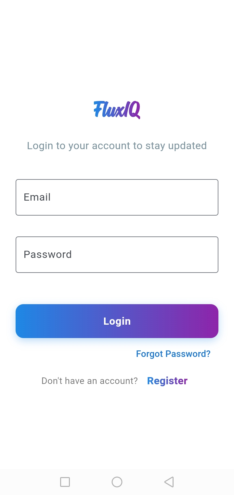
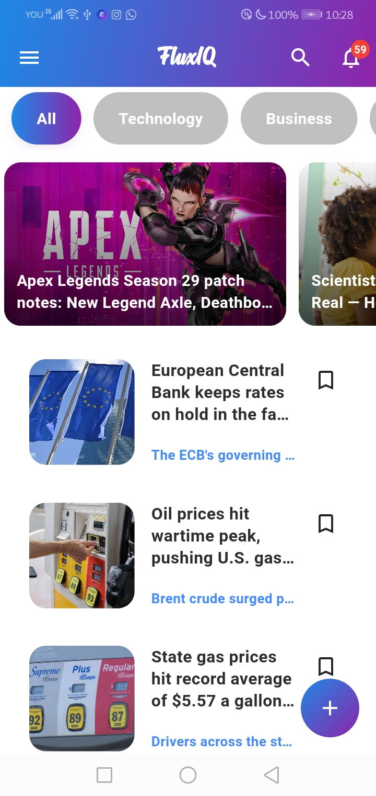
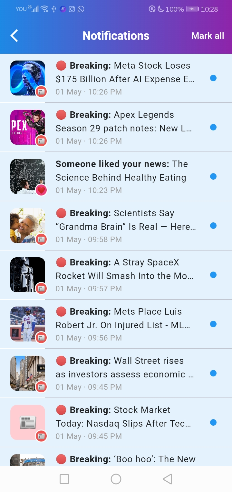

```markdown
# FluxIQ

## Overview
FluxIQ is a comprehensive news application that combines API-sourced content with user-generated News,
creating a hybrid news ecosystem.. The app provides a seamless and dynamic news experience, 
merging global news from external APIs with user-generated content into a single, cohesive platform.
The application is architected following the MVVM (Model-View-ViewModel) design pattern and 
utilizes Riverpod for robust state management. This ensures a clean, 
maintainable, and scalable codebase. The backend is powered 
by Firebase (Authentication, Firestore, FCM) with integrated REST APIs for specific services.

## Key Features
- OnBoarding Screens
- Splash Screen
- User Authentication (Email/Password)
- OAuth Support: Fast sign-in via Google.
- Reset Password
- Welcome Emails: Automatic email triggers to welcome new users.
- Session Management: Auto-check user status to redirect to Home or Auth screens seamlessly.
- Home Screen with Dynamic news
- Dynamic Categories
- Hybrid Content Model
- Infinite Scrolling
- Breaking News
- new Creation: 
- My News & Deletion:
- Search & Filtering:
- News Details & Interaction:
- Likes System:
- Views Tracking: 
- Favorites: 
- Sharing System:
- Notifications: (FCM): Background notifications and In-App Notifications
- Light/Dark Theme Support
- Shimmer Loading Effects
- Responsive Design
- Theme Support: Toggle between Light and Dark modes.
- Responsive Design: Fully adaptive layout across different device sizes.

# 📱 Screenshots

<table>
  <tr>
    <td align="center">
      
      <br/>OnBoarding
    </td>
    <td align="center">
      
      <br/>Login Screen
    </td>
    <td align="center">
      
      <br/>Home Screen
    </td>
    <td align="center">
      
      <br/>News Detail
    </td>
  </tr>
  <tr>
    <td align="center">
      
      <br/>Notifications
    </td>
  </tr>
</table>

## Planned
- Advanced analytics panel
- AI-powered news summarization
- Report news system
- Multi-language full localization

## Tech Stack
| Layer | Technology |
| :--- | :--- |
| Framework | Flutter 3.27.4 |
| Language | Dart 3.6.2 |
| Architecture | MVVM |
| State Management | Riverpod |
| Backend | Firebase (Auth, Firestore, FCM) |
| REST API | Node.js + Resend |
| Database | Cloud Firestore |
| Notifications | Firebase Messaging + Local Notifications |
| Networking | dio, http |
| Local Storage | hive, shared_preferences |
| Environment | ^6.0.0 |
| Image Caching | cached_network_image 3.4.1 |

## Architecture
This project follows MVVM:
```text
lib/
├── core/                       <-- Shared logic, utilities, and global configurations
│   ├── connectivity/           <-- Network connection monitoring
│   ├── constants/              <-- App constants (API keys, strings, assets paths)
│   ├── error/                  <-- Custom exception handling and failure classes
│   ├── network/                <-- API client configuration (e.g., Dio or Http)
│   ├── provider/               <-- Global Riverpod providers
│   ├── router/                 <-- App navigation and routing logic
│   ├── services/               <--  services (FCM)
│   ├── theme/                  <-- App styling (Colors, Fonts, Dark/Light mode)
│   ├── utils/                  <-- Helper functions and extensions
│   └── widgets/                <-- Common UI components used across the app
│
├── features/                   <-- Feature-First Architecture
│   ├── auth/                   <-- Authentication Feature
│   │   ├── core/               <-- Feature-specific helpers
│   │   ├── datasource/         <-- Data fetching (Remote/Local APIs)
│   │   ├── model/              <-- Data models (JSON parsing)
│   │   ├── provider/           <-- UI-specific Riverpod providers
│   │   ├── repository/         <-- Bridge between data and logic
│   │   ├── state/              <-- Logic states (Loading, Success, Error)
│   │   ├── ui/                 <-- Views/Screens for this feature
│   │   └── viewmodel/          <-- Business logic (MVVM)
│   │
│   ├── news/                   <-- News Feature
│   │   ├── datasource/
│   │   ├── model/
│   │   ├── repository/
│   │   ├── state/
│   │   ├── ui/
│   │   └── viewmodel/
│   │
│   ├── notification/           <-- Notifications Feature
│   │   ├── datasources/
│   │   ├── model/
│   │   ├── repository/
│   │   ├── state/
│   │   ├── screens/            <-- UI Views
│   │   └── viewmodels/
│   │
│   ├── favorites/              <-- 
│   ├── likes/                  <-- 
│   ├── sharing/                <-- 
│   └── views/                  <-- 
│
├── main.dart                   <-- Application entry point
```

## Project Structure
```text
FluxIQ/
├── android/                 # Android native code
├── ios/                     # iOS native code
├── lib/
│   ├── core/               # Core functionality
│   │   ├── Services/       # Fcm services
│   │   └── ...
│   ├── features/           # Feature modules
│   ├── main.dart
│   ├── firebase_options.dart  # Firebase configuration
│   └── main.dart            # App entry point
├── test/                   # Unit & widget tests
├── assets/
│   ├── fonts/              # Custom fonts
│   ├── images/             # Image assets and Logo assets
│   ├── icons/              # Icon assets
│   
├── .gitignore              #
├── test/                   #unit test
├── pubspec.yaml
└── README.md
```

## Getting Started

### Prerequisites
- Flutter SDK 3.27.4 or higher
- Dart 3.6.2 or higher
- Android Studio / VS Code
- Firebase Account (free tier available)

### Installation
1. **Clone the repository**
   ```bash
   git clone https://github.com/ahmedalibob2stone/fluxiq.git
   cd FluxIQ
   ```
 
2. **Install dependencies**
   ```bash
   flutter pub get
   ```

3. **Setup Firebase**
 - a. Create a Firebase project at [Firebase Dashboard](https://console.firebase.google.com/)
 - b. Install FlutterFire CLI: `dart pub global activate flutterfire_cli`
 - c. Run the configuration command in the project root: `flutterfire configure`

4. **Environment Variables**
   Create a `.env` file in the root directory:
   ```text
   Firebase_URL=https://your-project.firebaseio.com
   NEWS_API_KEY=*************************
   ```

5. **Run the app**

## Commands
```bash
# Get dependencies
flutter pub get

# Run development build
flutter run

# Build APK
flutter build apk 

# Run all tests
flutter test

# Run tests with coverage
flutter test --coverage

# Run specific test file
flutter test test/features/auth/repository/auth_repository_impl_test

# Run all unit tests
flutter test test/features/

# Run all integration tests
flutter test test/integration/

# Analyze code
flutter analyze

# Generate launcher icons
flutter pub run flutter_launcher_icons

# Generate splash screen
flutter pub run flutter_native_splash:create
```

## Testing
The project includes comprehensive unit and tests covering all features.

```text
test/                                              # Full test suite for FluxIQ Project
├── core/                                          # [Core Layer Testing]
│   ├── connectivity/
│   │   └── connectivity_datasource_test.dart      # Network connectivity & stream tests
│   ├── error/
│   │   ├── app_exception_test.dart                # Custom app exceptions testing
│   │   ├── auth_error_handler_test.dart           # Authentication error mapping tests
│   │   └── firestore_error_handler_test.dart      # Firebase Firestore error handling
│   ├── network/
│   │   └── check_internet_test.dart               # Internet availability verification
│   └── services/
│       └── fcm/
│           └── provider/
│               ├── fcm_service_provider_test.dart # Firebase Messaging provider tests
│               ├── fcm_message_handler_test.dart  # Notification payload handling
│               ├── fcm_service_test.dart          # Core FCM service logic
│               ├── fcm_service_token_test.dart    # Device token management tests
│               └── local_notification_service_test.dart # Local UI notifications
├── features/                                      # [Features Layer Testing]
│   ├── auth/                                      # Authentication System
│   │   ├── datasource/
│   │   │   └── remote/
│   │   │       ├── firebase/
│   │   │       │   └── auth_firebase_remote_data_source_test.dart
│   │   │       └── resend/
│   │   │           └── auth_remote_data_source_impl_test.dart
│   │   ├── provider/
│   │   │   └── auth_providers_test.dart           # Auth dependency injection tests
│   │   ├── repository/
│   │   │   └── auth_repository_impl_test.dart     # Auth data coordination logic
│   │   ├── state/
│   │   │   ├── auth_state_test.dart               # Login/Logout state transitions
│   │   │   └── password_reset_state_test.dart     # Password recovery state flow
│   │   └── viewmodel/
│   │       ├── auth_view_model_test.dart          # Auth UI logic & validation
│   │       ├── fake_viewmodel.dart                # Mock ViewModel for Auth tests
│   │       └── password_reset_view_model_test.dart # Password reset business logic
│   ├── favorites/                                 # Favorites System
│   │   ├── provider/
│   │   │   └── specific_favorite_provider_test.dart
│   │   ├── repository/
│   │   │   └── favorites_repository_test.dart
│   │   ├── state/
│   │   │   └── favorites_state_test.dart
│   │   └── view model/
│   │       └── favorites_view_model_test.dart
│   ├── likes/                                     # Likes & Engagement System
│   │   ├── provider/
│   │   │   └── user_likes_history_provider_test.dart
│   │   ├── repository/
│   │   │   └── likes_repository_test.dart
│   │   ├── state/
│   │   │   ├── likes_state_test.dart
│   │   │   └── user_likes_history_state_test.dart
│   │   └── viewmodel/
│   │       ├── likes_viewmodel_test.dart
│   │       └── user_likes_history_view_model_test.dart
│   ├── news/                                      # News Feed System
│   │   ├── data/
│   │   │   ├── datasource/
│   │   │   │   ├── news_api_datasource_test.dart
│   │   │   │   └── news_firebase_datasource_test.dart
│   │   │   └── repository/
│   │   │       └── news_repository_impl_test.dart
│   │   ├── helper/
│   │   │   └── fake_models.dart                  # Mock models for news data
│   │   ├── model/
│   │   │   └── category_item_test.dart           # JSON parsing & serialization tests
│   │   ├── provider/
│   │   │   ├── breaking_news_provider_test.dart
│   │   │   ├── publishing_news_provider_test.dart
│   │   │   └── search_news_provider_test.dart
│   │   ├── state/
│   │   │   ├── news_state_test.dart
│   │   │   ├── publish_news_state_test.dart
│   │   │   └── translation_state_test.dart       # Language translation state tests
│   │   └── viewmodel/
│   │       ├── breaking_news_vm_test.dart
│   │       ├── news_vm_test.dart
│   │       ├── publishing_news_vm_test.dart
│   │       ├── search_news_vm_test.dart
│   │       └── translation_viewmodel_test.dart
│   ├── notifications/                             # In-app Notification Logic
│   │   ├── datasource/
│   │   │   ├── firestore/
│   │   │   │   └── notification_firestore_datasource_test.dart
│   │   │   └── remote/
│   │   │       └── notification_remote_data_source_test.dart
│   │   ├── repository/
│   │   │   └── notification_repository_impl_test.dart
│   │   ├── state/
│   │   │   └── notification_state_test.dart
│   │   └── viewmodel/
│   │       └── notification_view_model_test.dart
│   ├── sharing/                                   # Content Sharing System
│   │   ├── datasource/
│   │   │   ├── share_local_datasource_test.dart
│   │   │   └── share_remote_datasource_test.dart
│   │   ├── provider/
│   │   │   └── share_view_model_provider.dart
│   │   ├── repository/
│   │   │   └── share_repository_test.dart
│   │   ├── state/
│   │   │   └── share_state_test.dart
│   │   └── viewmodel/
│   │       └── share_view_model_test.dart
│   └── views/                                     # View Count & Sync System
│       ├── datasource/
│       │   ├── location_remote_datasource_test.dart
│       │   └── views_local_datasource_test.dart
│       ├── provider/
│       │   ├── news_views_provider.dart
│       │   └── views_sync_test.dart               # Real-time view synchronization
│       ├── repository/
│       │   └── news_views_repository_test.dart
│       ├── state/
│       │   └── news_view_model_state_test.dart
│       └── viewmodel/
│           └── new_views_test.dart
├── helpers/                                       # Test Utilities & Mocks
│   ├── mock_assets.dart                           # Mocked asset files for tests
│   └── mocks.dart                                 # Centralized Mocktail/Mockito objects
└── main_test.dart                                 # Main test runner execution
```

### Running Tests:
```bash
# Run all tests
flutter test

# Run with verbose output
flutter test --reporter expanded

# Run specific feature tests
flutter test test/features/auth/
flutter test test/features/favorites
flutter test test/features/likes/
flutter test test/features/news/
flutter test test/features/notifications/
flutter test test/features/sharing/
flutter test test/features/views/

# Run integration tests
flutter test test/helpers/

# Generate coverage report
flutter test --coverage
```

### Test Dependencies
```yaml
dev_dependencies:
  flutter_test:
    sdk: flutter
  mocktail: ^1.0.4      # For mocking
  mockito: ^5.4.5
  fake_cloud_firestore: ^4.0.0
  flutter_riverpod: ^2.6.1
```

## Database Schema

| Table | Description |
| :--- | :--- |
| users | Stores all registered users' data in the application |
| favorites | Stores the news articles saved by each user as favorites |
| likenews | Stores the news articles liked by each user |
| news | The primary collection for all articles, including API-fetched content and user-posted news |
| likes | Stores the users who liked a specific news article |
| views | Stores the view records for each news article including ip and city and country |
| shares | Stores the users who shared a specific news article |
| shareDetails | Stores the details of each individual share action per user |
| notifications | Stores all in-app notifications sent to users |
| breaking_news_log | Stores a log of all breaking news that triggered push notifications |
| recipients | Stores the list of users who received a specific breaking news notification |

## Contributing
1. Fork the repository
2. Create a feature branch (`git checkout -b feature/amazing-feature`)
3. Commit your changes (`git commit -m 'Add amazing feature'`)
4. Push to the branch (`git push origin feature/amazing-feature`)
5. Open a Pull Request
6. Submit Pull Requests `ahmedalialobahi@gmail.com`

## License
This project is licensed under the MIT License - see the LICENSE file for details.

## About This Project
FluxIQ is a full-stack Flutter news application designed and developed entirely by **Ahmed Alobahi**.

- 📅 Started: 2025
- 🧠 Concept, Architecture & Implementation: Ahmed Alobahi
- 📧 Contact: [ahmedalialobahi@gmail.com]
- 🔗 GitHub: [github.com/ahmedalibob2stone]
- 📱 phone number: [+967 739506810]
```